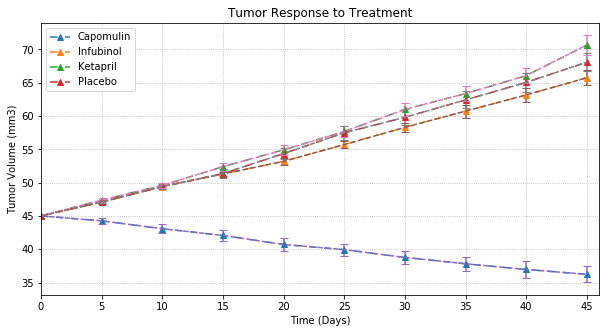
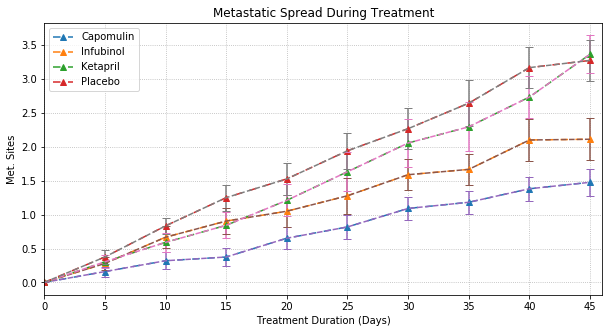
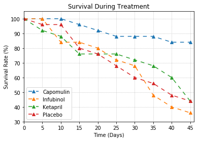
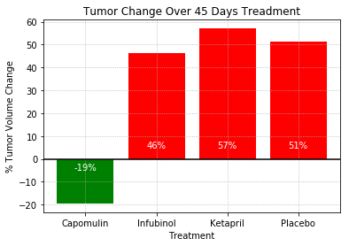

# Pymaceuticals Inc.

## Analysis
OBSERVED TREND 1
OBSERVED TREND 2
OBSERVED TREND 3


```python
# Dependencies
from matplotlib import pyplot as plt
from scipy.stats import linregress
import numpy as np
import pandas as pd
import seaborn as sns
```


```python
# Load in csv
cltrial_df = pd.read_csv("raw_data/clinicaltrial_data.csv")
mouse_drug_df = pd.read_csv("raw_data/mouse_drug_data.csv")

# Merge two dataframes using a left join
merge_df = pd.merge(cltrial_df, mouse_drug_df, on="Mouse ID", how="left")

# Filter ONLY four treatments (Capomulin, Infubinol, Ketapril, and Placebo) 
merge_df = merge_df[(merge_df["Drug"] == 'Capomulin') |
                      (merge_df["Drug"] == 'Infubinol') |
                      (merge_df["Drug"] == 'Ketapril') |
                      (merge_df["Drug"] == 'Placebo')
                     ]

merge_df.head()
```


<div>
<style scoped>
    .dataframe tbody tr th:only-of-type {
        vertical-align: middle;
    }

    .dataframe tbody tr th {
        vertical-align: top;
    }

    .dataframe thead th {
        text-align: right;
    }
</style>
<table border="1" class="dataframe">
  <thead>
    <tr style="text-align: right;">
      <th></th>
      <th>Mouse ID</th>
      <th>Timepoint</th>
      <th>Tumor Volume (mm3)</th>
      <th>Metastatic Sites</th>
      <th>Drug</th>
    </tr>
  </thead>
  <tbody>
    <tr>
      <th>0</th>
      <td>b128</td>
      <td>0</td>
      <td>45.0</td>
      <td>0</td>
      <td>Capomulin</td>
    </tr>
    <tr>
      <th>1</th>
      <td>f932</td>
      <td>0</td>
      <td>45.0</td>
      <td>0</td>
      <td>Ketapril</td>
    </tr>
    <tr>
      <th>2</th>
      <td>g107</td>
      <td>0</td>
      <td>45.0</td>
      <td>0</td>
      <td>Ketapril</td>
    </tr>
    <tr>
      <th>3</th>
      <td>a457</td>
      <td>0</td>
      <td>45.0</td>
      <td>0</td>
      <td>Ketapril</td>
    </tr>
    <tr>
      <th>4</th>
      <td>c819</td>
      <td>0</td>
      <td>45.0</td>
      <td>0</td>
      <td>Ketapril</td>
    </tr>
  </tbody>
</table>
</div>


### Tumor Response to Treatment


```python
# Group df by Treatment Type, and Timepoint for calculation
grouped_drug_tp = merge_df.groupby(['Drug','Timepoint'])

# create new df for each Treatment and tumor volume for each timepoint
avg_volumn = pd.DataFrame(grouped_drug_tp["Tumor Volume (mm3)"].mean())
avg_volumn
```


<div>
<style scoped>
    .dataframe tbody tr th:only-of-type {
        vertical-align: middle;
    }

    .dataframe tbody tr th {
        vertical-align: top;
    }

    .dataframe thead th {
        text-align: right;
    }
</style>
<table border="1" class="dataframe">
  <thead>
    <tr style="text-align: right;">
      <th></th>
      <th></th>
      <th>Tumor Volume (mm3)</th>
    </tr>
    <tr>
      <th>Drug</th>
      <th>Timepoint</th>
      <th></th>
    </tr>
  </thead>
  <tbody>
    <tr>
      <th rowspan="10" valign="top">Capomulin</th>
      <th>0</th>
      <td>45.000000</td>
    </tr>
    <tr>
      <th>5</th>
      <td>44.266086</td>
    </tr>
    <tr>
      <th>10</th>
      <td>43.084291</td>
    </tr>
    <tr>
      <th>15</th>
      <td>42.064317</td>
    </tr>
    <tr>
      <th>20</th>
      <td>40.716325</td>
    </tr>
    <tr>
      <th>25</th>
      <td>39.939528</td>
    </tr>
    <tr>
      <th>30</th>
      <td>38.769339</td>
    </tr>
    <tr>
      <th>35</th>
      <td>37.816839</td>
    </tr>
    <tr>
      <th>40</th>
      <td>36.958001</td>
    </tr>
    <tr>
      <th>45</th>
      <td>36.236114</td>
    </tr>
    <tr>
      <th rowspan="10" valign="top">Infubinol</th>
      <th>0</th>
      <td>45.000000</td>
    </tr>
    <tr>
      <th>5</th>
      <td>47.062001</td>
    </tr>
    <tr>
      <th>10</th>
      <td>49.403909</td>
    </tr>
    <tr>
      <th>15</th>
      <td>51.296397</td>
    </tr>
    <tr>
      <th>20</th>
      <td>53.197691</td>
    </tr>
    <tr>
      <th>25</th>
      <td>55.715252</td>
    </tr>
    <tr>
      <th>30</th>
      <td>58.299397</td>
    </tr>
    <tr>
      <th>35</th>
      <td>60.742461</td>
    </tr>
    <tr>
      <th>40</th>
      <td>63.162824</td>
    </tr>
    <tr>
      <th>45</th>
      <td>65.755562</td>
    </tr>
    <tr>
      <th rowspan="10" valign="top">Ketapril</th>
      <th>0</th>
      <td>45.000000</td>
    </tr>
    <tr>
      <th>5</th>
      <td>47.389175</td>
    </tr>
    <tr>
      <th>10</th>
      <td>49.582269</td>
    </tr>
    <tr>
      <th>15</th>
      <td>52.399974</td>
    </tr>
    <tr>
      <th>20</th>
      <td>54.920935</td>
    </tr>
    <tr>
      <th>25</th>
      <td>57.678982</td>
    </tr>
    <tr>
      <th>30</th>
      <td>60.994507</td>
    </tr>
    <tr>
      <th>35</th>
      <td>63.371686</td>
    </tr>
    <tr>
      <th>40</th>
      <td>66.068580</td>
    </tr>
    <tr>
      <th>45</th>
      <td>70.662958</td>
    </tr>
    <tr>
      <th rowspan="10" valign="top">Placebo</th>
      <th>0</th>
      <td>45.000000</td>
    </tr>
    <tr>
      <th>5</th>
      <td>47.125589</td>
    </tr>
    <tr>
      <th>10</th>
      <td>49.423329</td>
    </tr>
    <tr>
      <th>15</th>
      <td>51.359742</td>
    </tr>
    <tr>
      <th>20</th>
      <td>54.364417</td>
    </tr>
    <tr>
      <th>25</th>
      <td>57.482574</td>
    </tr>
    <tr>
      <th>30</th>
      <td>59.809063</td>
    </tr>
    <tr>
      <th>35</th>
      <td>62.420615</td>
    </tr>
    <tr>
      <th>40</th>
      <td>65.052675</td>
    </tr>
    <tr>
      <th>45</th>
      <td>68.084082</td>
    </tr>
  </tbody>
</table>
</div>


```python
# Create a new table to summarize Drug/Timepoint/Tumor Volume (mm3)
table_avg_volumn = pd.pivot_table(avg_volumn, values=["Tumor Volume (mm3)"], index=["Timepoint"], columns=["Drug"], aggfunc=np.sum)
table_avg_volumn 
```


<div>
<style scoped>
    .dataframe tbody tr th:only-of-type {
        vertical-align: middle;
    }

    .dataframe tbody tr th {
        vertical-align: top;
    }

    .dataframe thead tr th {
        text-align: left;
    }

    .dataframe thead tr:last-of-type th {
        text-align: right;
    }
</style>
<table border="1" class="dataframe">
  <thead>
    <tr>
      <th></th>
      <th colspan="4" halign="left">Tumor Volume (mm3)</th>
    </tr>
    <tr>
      <th>Drug</th>
      <th>Capomulin</th>
      <th>Infubinol</th>
      <th>Ketapril</th>
      <th>Placebo</th>
    </tr>
    <tr>
      <th>Timepoint</th>
      <th></th>
      <th></th>
      <th></th>
      <th></th>
    </tr>
  </thead>
  <tbody>
    <tr>
      <th>0</th>
      <td>45.000000</td>
      <td>45.000000</td>
      <td>45.000000</td>
      <td>45.000000</td>
    </tr>
    <tr>
      <th>5</th>
      <td>44.266086</td>
      <td>47.062001</td>
      <td>47.389175</td>
      <td>47.125589</td>
    </tr>
    <tr>
      <th>10</th>
      <td>43.084291</td>
      <td>49.403909</td>
      <td>49.582269</td>
      <td>49.423329</td>
    </tr>
    <tr>
      <th>15</th>
      <td>42.064317</td>
      <td>51.296397</td>
      <td>52.399974</td>
      <td>51.359742</td>
    </tr>
    <tr>
      <th>20</th>
      <td>40.716325</td>
      <td>53.197691</td>
      <td>54.920935</td>
      <td>54.364417</td>
    </tr>
    <tr>
      <th>25</th>
      <td>39.939528</td>
      <td>55.715252</td>
      <td>57.678982</td>
      <td>57.482574</td>
    </tr>
    <tr>
      <th>30</th>
      <td>38.769339</td>
      <td>58.299397</td>
      <td>60.994507</td>
      <td>59.809063</td>
    </tr>
    <tr>
      <th>35</th>
      <td>37.816839</td>
      <td>60.742461</td>
      <td>63.371686</td>
      <td>62.420615</td>
    </tr>
    <tr>
      <th>40</th>
      <td>36.958001</td>
      <td>63.162824</td>
      <td>66.068580</td>
      <td>65.052675</td>
    </tr>
    <tr>
      <th>45</th>
      <td>36.236114</td>
      <td>65.755562</td>
      <td>70.662958</td>
      <td>68.084082</td>
    </tr>
  </tbody>
</table>
</div>


```python
# Create a new table to calculate standard err Drug/Timepoint/Tumor Volume (mm3)
sem_volumn = pd.DataFrame(grouped_drug_tp["Tumor Volume (mm3)"].sem())
table_sem_volumn = pd.pivot_table(sem_volumn, values=["Tumor Volume (mm3)"], index=["Timepoint"], columns=["Drug"])
table_sem_volumn                      
```


<div>
<style scoped>
    .dataframe tbody tr th:only-of-type {
        vertical-align: middle;
    }

    .dataframe tbody tr th {
        vertical-align: top;
    }

    .dataframe thead tr th {
        text-align: left;
    }

    .dataframe thead tr:last-of-type th {
        text-align: right;
    }
</style>
<table border="1" class="dataframe">
  <thead>
    <tr>
      <th></th>
      <th colspan="4" halign="left">Tumor Volume (mm3)</th>
    </tr>
    <tr>
      <th>Drug</th>
      <th>Capomulin</th>
      <th>Infubinol</th>
      <th>Ketapril</th>
      <th>Placebo</th>
    </tr>
    <tr>
      <th>Timepoint</th>
      <th></th>
      <th></th>
      <th></th>
      <th></th>
    </tr>
  </thead>
  <tbody>
    <tr>
      <th>0</th>
      <td>0.000000</td>
      <td>0.000000</td>
      <td>0.000000</td>
      <td>0.000000</td>
    </tr>
    <tr>
      <th>5</th>
      <td>0.448593</td>
      <td>0.235102</td>
      <td>0.264819</td>
      <td>0.218091</td>
    </tr>
    <tr>
      <th>10</th>
      <td>0.702684</td>
      <td>0.282346</td>
      <td>0.357421</td>
      <td>0.402064</td>
    </tr>
    <tr>
      <th>15</th>
      <td>0.838617</td>
      <td>0.357705</td>
      <td>0.580268</td>
      <td>0.614461</td>
    </tr>
    <tr>
      <th>20</th>
      <td>0.909731</td>
      <td>0.476210</td>
      <td>0.726484</td>
      <td>0.839609</td>
    </tr>
    <tr>
      <th>25</th>
      <td>0.881642</td>
      <td>0.550315</td>
      <td>0.755413</td>
      <td>1.034872</td>
    </tr>
    <tr>
      <th>30</th>
      <td>0.934460</td>
      <td>0.631061</td>
      <td>0.934121</td>
      <td>1.218231</td>
    </tr>
    <tr>
      <th>35</th>
      <td>1.052241</td>
      <td>0.984155</td>
      <td>1.127867</td>
      <td>1.287481</td>
    </tr>
    <tr>
      <th>40</th>
      <td>1.223608</td>
      <td>1.055220</td>
      <td>1.158449</td>
      <td>1.370634</td>
    </tr>
    <tr>
      <th>45</th>
      <td>1.223977</td>
      <td>1.144427</td>
      <td>1.453186</td>
      <td>1.351726</td>
    </tr>
  </tbody>
</table>
</div>


```python
# Draw a chart shows the average of tumor volume during time periods
plot_avg_volumn = table_avg_volumn.plot(grid=True,
                                        title="Tumor Response to Treatment",
                                        LineStyle = (0, (5, 5)),
                                        figsize = (10,5),
                                        marker = "^"
                                       )

# formating the plot   
plt.xlabel('Time (Days)')
plt.ylabel('Tumor Volume (mm3)')
plt.xticks(np.arange(0, table_avg_volumn.index.max()+1 , 5)) 
plt.xlim(0, table_avg_volumn.index.max()+1) 
plt.legend(['Capomulin', 'Infubinol', 'Ketapril', 'Placebo'])
plt.grid(linestyle='dotted')

# Drawing the error bar for average tumor volume, matching it into above chart
x_err = table_avg_volumn.index 

for Drug in table_avg_volumn.columns:
    plt.errorbar(x_err, 
                 table_avg_volumn[Drug], 
                 table_sem_volumn[Drug],
                 linestyle = '--', 
                 capthick = 1, 
                 capsize = 4)
    count += 1

plt.show()
```





### Metastatic Response to Treatment


```python
# Group df by Treatment Type, and Timepoint for calculation
#grouped_drug_tp = merge_df.groupby(['Drug','Timepoint'])

# create new df for each Treatment and Metastatic Sites for seach timepoint
avg_meta = pd.DataFrame(grouped_drug_tp["Metastatic Sites"].mean())
avg_meta
```


<div>
<style scoped>
    .dataframe tbody tr th:only-of-type {
        vertical-align: middle;
    }

    .dataframe tbody tr th {
        vertical-align: top;
    }

    .dataframe thead th {
        text-align: right;
    }
</style>
<table border="1" class="dataframe">
  <thead>
    <tr style="text-align: right;">
      <th></th>
      <th></th>
      <th>Metastatic Sites</th>
    </tr>
    <tr>
      <th>Drug</th>
      <th>Timepoint</th>
      <th></th>
    </tr>
  </thead>
  <tbody>
    <tr>
      <th rowspan="10" valign="top">Capomulin</th>
      <th>0</th>
      <td>0.000000</td>
    </tr>
    <tr>
      <th>5</th>
      <td>0.160000</td>
    </tr>
    <tr>
      <th>10</th>
      <td>0.320000</td>
    </tr>
    <tr>
      <th>15</th>
      <td>0.375000</td>
    </tr>
    <tr>
      <th>20</th>
      <td>0.652174</td>
    </tr>
    <tr>
      <th>25</th>
      <td>0.818182</td>
    </tr>
    <tr>
      <th>30</th>
      <td>1.090909</td>
    </tr>
    <tr>
      <th>35</th>
      <td>1.181818</td>
    </tr>
    <tr>
      <th>40</th>
      <td>1.380952</td>
    </tr>
    <tr>
      <th>45</th>
      <td>1.476190</td>
    </tr>
    <tr>
      <th rowspan="10" valign="top">Infubinol</th>
      <th>0</th>
      <td>0.000000</td>
    </tr>
    <tr>
      <th>5</th>
      <td>0.280000</td>
    </tr>
    <tr>
      <th>10</th>
      <td>0.666667</td>
    </tr>
    <tr>
      <th>15</th>
      <td>0.904762</td>
    </tr>
    <tr>
      <th>20</th>
      <td>1.050000</td>
    </tr>
    <tr>
      <th>25</th>
      <td>1.277778</td>
    </tr>
    <tr>
      <th>30</th>
      <td>1.588235</td>
    </tr>
    <tr>
      <th>35</th>
      <td>1.666667</td>
    </tr>
    <tr>
      <th>40</th>
      <td>2.100000</td>
    </tr>
    <tr>
      <th>45</th>
      <td>2.111111</td>
    </tr>
    <tr>
      <th rowspan="10" valign="top">Ketapril</th>
      <th>0</th>
      <td>0.000000</td>
    </tr>
    <tr>
      <th>5</th>
      <td>0.304348</td>
    </tr>
    <tr>
      <th>10</th>
      <td>0.590909</td>
    </tr>
    <tr>
      <th>15</th>
      <td>0.842105</td>
    </tr>
    <tr>
      <th>20</th>
      <td>1.210526</td>
    </tr>
    <tr>
      <th>25</th>
      <td>1.631579</td>
    </tr>
    <tr>
      <th>30</th>
      <td>2.055556</td>
    </tr>
    <tr>
      <th>35</th>
      <td>2.294118</td>
    </tr>
    <tr>
      <th>40</th>
      <td>2.733333</td>
    </tr>
    <tr>
      <th>45</th>
      <td>3.363636</td>
    </tr>
    <tr>
      <th rowspan="10" valign="top">Placebo</th>
      <th>0</th>
      <td>0.000000</td>
    </tr>
    <tr>
      <th>5</th>
      <td>0.375000</td>
    </tr>
    <tr>
      <th>10</th>
      <td>0.833333</td>
    </tr>
    <tr>
      <th>15</th>
      <td>1.250000</td>
    </tr>
    <tr>
      <th>20</th>
      <td>1.526316</td>
    </tr>
    <tr>
      <th>25</th>
      <td>1.941176</td>
    </tr>
    <tr>
      <th>30</th>
      <td>2.266667</td>
    </tr>
    <tr>
      <th>35</th>
      <td>2.642857</td>
    </tr>
    <tr>
      <th>40</th>
      <td>3.166667</td>
    </tr>
    <tr>
      <th>45</th>
      <td>3.272727</td>
    </tr>
  </tbody>
</table>
</div>


```python
# Create a new table to summarize Drug/Timepoint/Metastatic Sites
table_avg_meta = pd.pivot_table(avg_meta, values=["Metastatic Sites"], index=["Timepoint"], columns=["Drug"], aggfunc=np.sum)
table_avg_meta
```


<div>
<style scoped>
    .dataframe tbody tr th:only-of-type {
        vertical-align: middle;
    }

    .dataframe tbody tr th {
        vertical-align: top;
    }

    .dataframe thead tr th {
        text-align: left;
    }

    .dataframe thead tr:last-of-type th {
        text-align: right;
    }
</style>
<table border="1" class="dataframe">
  <thead>
    <tr>
      <th></th>
      <th colspan="4" halign="left">Metastatic Sites</th>
    </tr>
    <tr>
      <th>Drug</th>
      <th>Capomulin</th>
      <th>Infubinol</th>
      <th>Ketapril</th>
      <th>Placebo</th>
    </tr>
    <tr>
      <th>Timepoint</th>
      <th></th>
      <th></th>
      <th></th>
      <th></th>
    </tr>
  </thead>
  <tbody>
    <tr>
      <th>0</th>
      <td>0.000000</td>
      <td>0.000000</td>
      <td>0.000000</td>
      <td>0.000000</td>
    </tr>
    <tr>
      <th>5</th>
      <td>0.160000</td>
      <td>0.280000</td>
      <td>0.304348</td>
      <td>0.375000</td>
    </tr>
    <tr>
      <th>10</th>
      <td>0.320000</td>
      <td>0.666667</td>
      <td>0.590909</td>
      <td>0.833333</td>
    </tr>
    <tr>
      <th>15</th>
      <td>0.375000</td>
      <td>0.904762</td>
      <td>0.842105</td>
      <td>1.250000</td>
    </tr>
    <tr>
      <th>20</th>
      <td>0.652174</td>
      <td>1.050000</td>
      <td>1.210526</td>
      <td>1.526316</td>
    </tr>
    <tr>
      <th>25</th>
      <td>0.818182</td>
      <td>1.277778</td>
      <td>1.631579</td>
      <td>1.941176</td>
    </tr>
    <tr>
      <th>30</th>
      <td>1.090909</td>
      <td>1.588235</td>
      <td>2.055556</td>
      <td>2.266667</td>
    </tr>
    <tr>
      <th>35</th>
      <td>1.181818</td>
      <td>1.666667</td>
      <td>2.294118</td>
      <td>2.642857</td>
    </tr>
    <tr>
      <th>40</th>
      <td>1.380952</td>
      <td>2.100000</td>
      <td>2.733333</td>
      <td>3.166667</td>
    </tr>
    <tr>
      <th>45</th>
      <td>1.476190</td>
      <td>2.111111</td>
      <td>3.363636</td>
      <td>3.272727</td>
    </tr>
  </tbody>
</table>
</div>


```python
# Create a new table to calculate standard err Drug/Timepoint/Metastatic Sites
sem_meta = pd.DataFrame(grouped_drug_tp["Metastatic Sites"].sem())
table_sem_meta = pd.pivot_table(sem_meta, values=["Metastatic Sites"], index=["Timepoint"], columns=["Drug"])
table_sem_meta     
```


<div>
<style scoped>
    .dataframe tbody tr th:only-of-type {
        vertical-align: middle;
    }

    .dataframe tbody tr th {
        vertical-align: top;
    }

    .dataframe thead tr th {
        text-align: left;
    }

    .dataframe thead tr:last-of-type th {
        text-align: right;
    }
</style>
<table border="1" class="dataframe">
  <thead>
    <tr>
      <th></th>
      <th colspan="4" halign="left">Metastatic Sites</th>
    </tr>
    <tr>
      <th>Drug</th>
      <th>Capomulin</th>
      <th>Infubinol</th>
      <th>Ketapril</th>
      <th>Placebo</th>
    </tr>
    <tr>
      <th>Timepoint</th>
      <th></th>
      <th></th>
      <th></th>
      <th></th>
    </tr>
  </thead>
  <tbody>
    <tr>
      <th>0</th>
      <td>0.000000</td>
      <td>0.000000</td>
      <td>0.000000</td>
      <td>0.000000</td>
    </tr>
    <tr>
      <th>5</th>
      <td>0.074833</td>
      <td>0.091652</td>
      <td>0.098100</td>
      <td>0.100947</td>
    </tr>
    <tr>
      <th>10</th>
      <td>0.125433</td>
      <td>0.159364</td>
      <td>0.142018</td>
      <td>0.115261</td>
    </tr>
    <tr>
      <th>15</th>
      <td>0.132048</td>
      <td>0.194015</td>
      <td>0.191381</td>
      <td>0.190221</td>
    </tr>
    <tr>
      <th>20</th>
      <td>0.161621</td>
      <td>0.234801</td>
      <td>0.236680</td>
      <td>0.234064</td>
    </tr>
    <tr>
      <th>25</th>
      <td>0.181818</td>
      <td>0.265753</td>
      <td>0.288275</td>
      <td>0.263888</td>
    </tr>
    <tr>
      <th>30</th>
      <td>0.172944</td>
      <td>0.227823</td>
      <td>0.347467</td>
      <td>0.300264</td>
    </tr>
    <tr>
      <th>35</th>
      <td>0.169496</td>
      <td>0.224733</td>
      <td>0.361418</td>
      <td>0.341412</td>
    </tr>
    <tr>
      <th>40</th>
      <td>0.175610</td>
      <td>0.314466</td>
      <td>0.315725</td>
      <td>0.297294</td>
    </tr>
    <tr>
      <th>45</th>
      <td>0.202591</td>
      <td>0.309320</td>
      <td>0.278722</td>
      <td>0.304240</td>
    </tr>
  </tbody>
</table>
</div>


```python
# Draw a chart shows the average of Metastatic Sites during time periods
plot_avg_meta = table_avg_meta.plot(grid=True,
                                        title="Metastatic Spread During Treatment",
                                        LineStyle = (0, (5, 5)),
                                        figsize = (10,5),
                                        marker = "^"
                                       )

# formating the plot   
plt.xlabel('Treatment Duration (Days)')
plt.ylabel('Met. Sites')
plt.xticks(np.arange(0, table_avg_meta.index.max()+1 , 5)) 
plt.xlim(0, table_avg_meta.index.max()+1) 
plt.legend(['Capomulin', 'Infubinol', 'Ketapril', 'Placebo'])
plt.grid(linestyle='dotted')

# Drawing the error bar for average met sites, matching it into above chart
x_err_meta = table_avg_meta.index 

for Drug in table_avg_meta.columns:
    plt.errorbar(x_err_meta, 
                 table_avg_meta[Drug], 
                 table_sem_meta[Drug],
                 linestyle = '--', 
                 capthick = 1, 
                 capsize = 4)
    count += 1

plt.show()
```





### Survival Rates


```python
# create new df for each Treatment and Metastatic Sites for seach timepoint
count_id = pd.DataFrame(grouped_drug_tp["Mouse ID"].count())
# rearrange the table
count_id = count_id.unstack(level = 0)
count_id
```


<div>
<style scoped>
    .dataframe tbody tr th:only-of-type {
        vertical-align: middle;
    }

    .dataframe tbody tr th {
        vertical-align: top;
    }

    .dataframe thead tr th {
        text-align: left;
    }

    .dataframe thead tr:last-of-type th {
        text-align: right;
    }
</style>
<table border="1" class="dataframe">
  <thead>
    <tr>
      <th></th>
      <th colspan="4" halign="left">Mouse ID</th>
    </tr>
    <tr>
      <th>Drug</th>
      <th>Capomulin</th>
      <th>Infubinol</th>
      <th>Ketapril</th>
      <th>Placebo</th>
    </tr>
    <tr>
      <th>Timepoint</th>
      <th></th>
      <th></th>
      <th></th>
      <th></th>
    </tr>
  </thead>
  <tbody>
    <tr>
      <th>0</th>
      <td>25</td>
      <td>25</td>
      <td>25</td>
      <td>25</td>
    </tr>
    <tr>
      <th>5</th>
      <td>25</td>
      <td>25</td>
      <td>23</td>
      <td>24</td>
    </tr>
    <tr>
      <th>10</th>
      <td>25</td>
      <td>21</td>
      <td>22</td>
      <td>24</td>
    </tr>
    <tr>
      <th>15</th>
      <td>24</td>
      <td>21</td>
      <td>19</td>
      <td>20</td>
    </tr>
    <tr>
      <th>20</th>
      <td>23</td>
      <td>20</td>
      <td>19</td>
      <td>19</td>
    </tr>
    <tr>
      <th>25</th>
      <td>22</td>
      <td>18</td>
      <td>19</td>
      <td>17</td>
    </tr>
    <tr>
      <th>30</th>
      <td>22</td>
      <td>17</td>
      <td>18</td>
      <td>15</td>
    </tr>
    <tr>
      <th>35</th>
      <td>22</td>
      <td>12</td>
      <td>17</td>
      <td>14</td>
    </tr>
    <tr>
      <th>40</th>
      <td>21</td>
      <td>10</td>
      <td>15</td>
      <td>12</td>
    </tr>
    <tr>
      <th>45</th>
      <td>21</td>
      <td>9</td>
      <td>11</td>
      <td>11</td>
    </tr>
  </tbody>
</table>
</div>


```python
# Draw a chart shows the alive mice % (mice count at a timepoint / beginning count) during time periods

x_axis = count_id.index

for Drug in count_id:
    y_axis = count_id[Drug]/count_id.loc[0,Drug]*100 #alive count divided by beginning mice count
    plt.plot(x_axis, 
             y_axis, 
             linestyle = (0, (5, 5)), 
             marker = "^"
             )
    count += 1
    
# formating the plot    

plt.title('Survival During Treatment')
plt.xlabel('Time (Days)')
plt.ylabel('Survival Rate (%)')
plt.xticks(np.arange(0, table_avg_meta.index.max()+1 , 5)) 
plt.xlim(0, count_id.index.max()+1) 
plt.ylim(40,105)
plt.legend(['Capomulin', 'Infubinol', 'Ketapril', 'Placebo'], loc='best')
plt.grid(linestyle='dotted')

plt.show()
```





### Summary Bar Graph


```python
# create new df for each Treatment and Metastatic Sites for seach timepoint
volume_change = (avg_volumn.loc[45,:] - avg_volumn.loc[0, :])/avg_volumn.loc[0, :] * 100
volume_change

```


    Drug
    Capomulin   -19.475303
    Infubinol    46.123472
    Ketapril     57.028795
    Placebo      51.297960
    dtype: float64


```python
# Draw a Graph for Tumor Change % over Treatment
x_axis = np.arange(len(volume_change))
plt.bar(x_axis, 
        volume_change, 
        color=["r" if volume_change[i] >0 else "g" for i in np.arange(len(x_axis))],
        align="center",
        )
tick_locations = [value for value in x_axis]
plt.xticks(tick_locations, tumor_change.index)

# Formatting the Plot
plt.title("Tumor Change Over 45 Days Treadment")
plt.xlabel("Treatment")
plt.ylabel("% Tumor Volume Change")
plt.grid(linestyle='dotted')
plt.axhline(y=0, color = 'black')


# Putting Value to the center of bar chart
count = 0
for x in volume_change:
    if x < 0:
        value_spot = -5
    else:
        value_spot = 5
    plt.text(count, value_spot, str(round(x)) + '%', ha = 'center', color = 'w')
    count +=1

```




